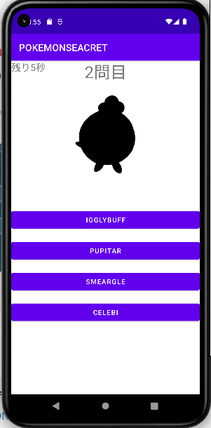

## android課題 

## 実装できた機能  
- 画像の黒塗り
- 制限時間カウント機能
- 世代ごとに問題を出題
- 問題をランダムに出題
- 1セット１０問
- 結果画面で正解数を表示

## 実装できなかった機能  
- クイズ出題画面で戻るボタンを押しても世代選択画面に戻らない  

### シークレットクイズの画面  

#### タイトル画面

#### 世代選択画面 

#### クイズ出題画面 

#### 結果画面

